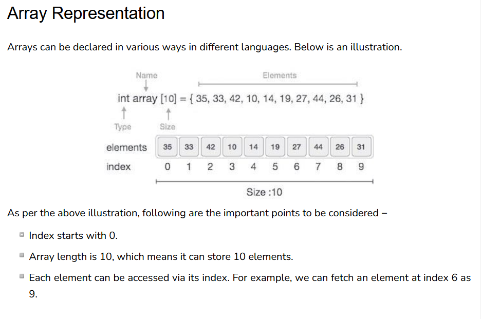

# Array 
- array is a container which can hold a fix number of items and these items should be of the same type
- Most of the data structures make use of arrays to implement their algorithms
- element => each item stored in an array is called an element
- index   => each location of an element in an array has a numerical index, which is used to identify the element
- Index starts with 0.

# Basic Operations
- The basic operations supported by an array are as stated below −

    -- Traverse − print all the array elements one by one.

    -- Insertion − Adds an element at the given index.

    -- Deletion − Deletes an element at the given index.

    -- Search − Searches an element using the given index or by the value.

    -- Update − Updates an element at the given index.

- array is created in python by importing the array module to the program, then the array is declared as following:

from array import *

arrayName = array(typecode,[initializers])

- Typecode are the codes that are used to define the type of value the array will hold. Some common typecodes used are as follows −

Typecode  |	Value
----------|----------------------------------------------     
b 	      |    Represents signed integer of size 1 byte
B 	      |    Represents unsigned integer of size 1 byte
c 	      |    Represents character of size 1 byte
i 	      |    Represents signed integer of size 2 bytes
I 	      |    Represents unsigned integer of size 2 bytes
f 	      |    Represents floating point of size 4 bytes
d 	      |    Represents floating point of size 8 bytes

